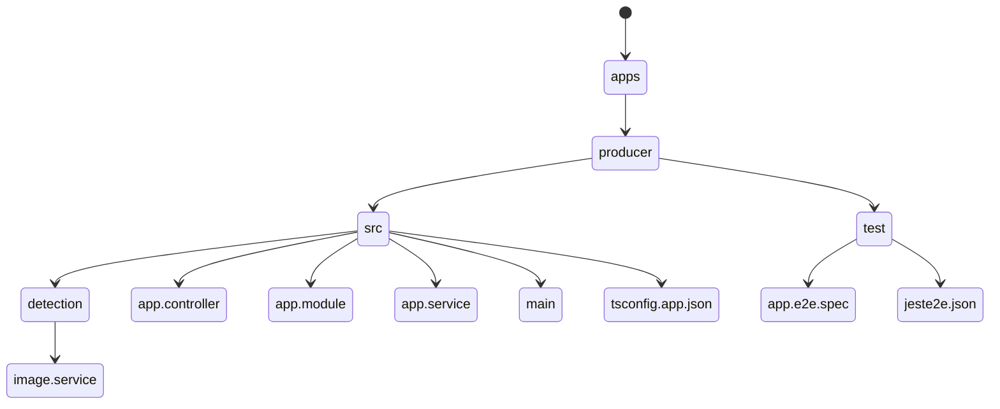
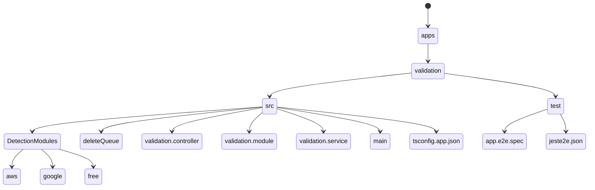

# SafeSearch-Detection

## Description

This is a project to detect the safe search of an image.
The detection can be done in three ways:

1. AWS Rekognition
2. Google Vision
3. Free API (Tensorflow)

> **Note**
The free API is not ready yet.

The detection can be switched from the `validation.controller.ts` file.
It is advised to use the AWS Rekognition as it is the most accurate, verbose and is directly integrated with AWS S3.

## Project Structure

### Producer



### Validation



---

## Installation

1. Clone the repository

```sh
git clone https://github.com/legendhimself/SafeSearch-Detection.git
```

2. Install the requirements

```sh
yarn
```

## Running the application

---

### Add your .env file in the root directory

```sh
cp .env.example .env
# Edit the .env file
```

### Development

---

1. Development both producer and validation

```sh
yarn start:dev
```

2. Development only producer

```sh
yarn start:dev:producer
```

3. Development only validation

```sh
yarn start:dev:validation
```

### Production

---

1. Build

```sh
yarn build
```

2. Production only producer

```sh
yarn start:prod:producer
```

3. Production only validation

```sh
yarn start:prod:validation
```
