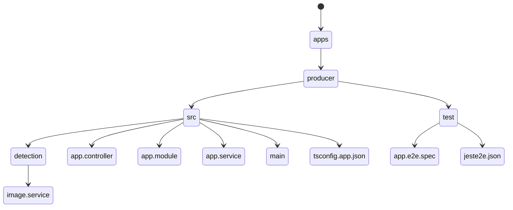
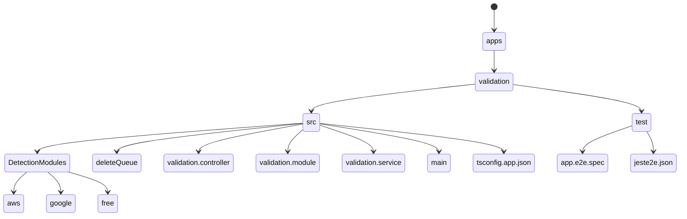

# SafeSearch-Detection

## Description

This is a project to detect the safe search of an image.
The detection can be done in three ways:

1. AWS Rekognition
2. Google Vision
3. Free API (Tensorflow)

> **Note**
> The free API is not ready yet.

The detection can be switched from the [`validation.controller.ts`](./apps/validation/src/validation.controller.ts) file.
It is advised to use the AWS Rekognition as it is the most accurate, verbose and is directly integrated with AWS S3.

## Project Structure

### Producer



### Validation



---

## Installation

1. Clone the repository

```sh
git clone https://github.com/legendhimself/SafeSearch-Detection.git
```

2. Install the requirements

```sh
yarn
```

## Running the application

---

### Add your .env file in the root directory

```sh
cp .env.example .env
# Edit the .env file
```

> **Note**
> Download the Google Service Account Key for Cloud Vision and add it to the root directory and add the file name to `.env` `credFileName=filename.json`

### Development

---

1. Development both producer and validation

```sh
yarn start:dev
```

2. Development only producer

```sh
yarn start:dev:producer
```

3. Development only validation

```sh
yarn start:dev:validation
```

### Production

---

1. Build

```sh
yarn build
```

2. Production only producer

```sh
yarn start:prod:producer
```

3. Production only validation

```sh
yarn start:prod:validation
```

## Testing the API

You can make request to the API using the following endpoints:

- `http://localhost:<port>/image/upload` - To add an image to the to the s3 bucket. Requires URL of the image in the body.
  The above endpoint will return success and s3 responseURL. If the image is not safe, it will delete the image from the s3 bucket in a few seconds.

> **Note** The RabbitMQ queue is of durable type, so if the validationService is not running, the messages will be stored in the queue and will be consumed when the validation service is up and running.

You can also test the API using the swagger UI at `http://localhost:<port>/api`

Testing with cli

### Unit Testing

```sh
yarn test
```

### End to End Testing

```sh
yarn test:e2e
```

## Detection Strictness

AWS - You can change the strictness of the detection by changing the `allowedSecondLevelLabels` and `allowedTopLevelLabels` in the [aws.ts](/apps/validation/src/DetectionModules/aws.ts) file.

Google - You can change the strictness of the detection by changing the `annotations` in the [google.ts](/apps/validation/src/DetectionModules/google.ts) file.

## Todo:

- [ ] Complete the Free API
- [x] Add more tests and e2e tests
- [ ] Add more documentation
